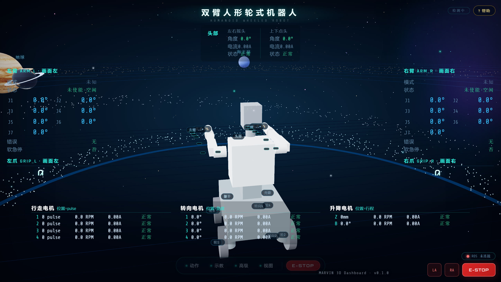

<div align="center">

# 🤖 MARVIN 3D Dashboard

**开源的机器人 Web 3D 遥操作 / 状态大屏模板 —— 双臂人形轮式机器人开箱即用**

[](LICENSE)
[](https://vuejs.org/)
[](https://threejs.org/)
[](https://github.com/gkjohnson/urdf-loader)
[](http://wiki.ros.org/rosbridge_suite)
[](https://github.com/Csihan/marvin-3d-dashboard/actions)

*纯前端实现 · 无需 ROS 也能浏览 · 三步接入你的机器人*



</div>

## 这是什么

一个用 **Vue 3 + TypeScript + Three.js + urdf-loader + roslibjs** 打造的机器人 3D
数字孪生大屏：左侧是可拖拽旋转的整机 3D 视图（URDF 直驱、关节级联动），四边是
纯文本 HUD 实时状态，支持**浏览器端直接遥操作**——拖关节控制球、键盘六轴 Jog、
底盘升降/弯腰滑杆，命令经安全门禁下发到 ROS。

我把它做成**模板**而不是封闭成品：内置一台纯几何示例机器人，克隆即跑；
换成你自己的 URDF，就是你机器人的控制台。

```bash
git clone https://github.com/Csihan/marvin-3d-dashboard.git
cd marvin-3d-dashboard && npm install && npm run dev   # http://localhost:5173

# 不想克隆？也可以当全局 CLI 用（服务构建产物，自动开浏览器）
npm install -g marvin-3d-dashboard
marvin                                                  # http://localhost:8080
```

## 🦾 接入你的机器人（三步）

内置示例 `demo_robot.urdf` 是一台纯 primitive 几何的开源示例机器人（双臂 7-DOF +
4WS 底盘 + 升降躯干 + 双轴头部，不含任何第三方 mesh 资产，版权干净）。
接入你自己的真实机器人只需三步：

1. 把你的整机 URDF（xacro 需先展开成静态 URDF）放到 `public/models/urdf/`；
2. 若 URDF 使用 `package://` mesh 路径：mesh 拷到 `public/models/urdf/meshes/<包名>/`，
   并在 `src/composables/useRobot3D.ts` 的 `PACKAGE_MAP` 登记包名 → 静态路径映射；
3. 把 `useRobot3D.ts` 中 `loader.load('/models/urdf/demo_robot.urdf', …)` 的路径
   改成你的文件名。关节命名若与示例不同，同步调整 `ARM_JOINTS`/`labels.ts` 等
   常量（都有注释标注）。

> **命名约定**：示例模型用 `Joint1~7_L/R`（双臂）、`gripper_L/R_joint`（夹爪）、
> `head_yaw/pitch_joint`（头部）、`torso_lift_joint`（升降）与 4 轮 4 转向关节——
> 同名即可零改动驱动；不同名则同步调整常量即可。
> 拖动方向与真机相反？翻转 `CHASSIS_AXIS_SIGN` 或用 `INVERT_JOINTS` 校准表逐关节吸收。

> **没有 ROS 环境也能玩**：页面右上角显示「ROS 未连接」是正常的——3D 模型拖拽、
> 关节控制球、示教面板、键盘 Jog 全部离线可用，只有命令下发被安全门禁拦截。
> 接上 rosbridge（`:9090`）自动变绿，详见 [QUICKSTART.md](QUICKSTART.md)。

## ✨ 特性

- 🖥️ **全屏 3D 数字孪生**：整机 URDF 直驱（非碎片化 GLB），模型结构与关节语义同源；
- 🎮 **浏览器遥操作**：3D 关节控制球（左键直拖 / Alt 精细×0.1 / 120ms 节流 / 松手补发终值）、
  键盘六轴 Jog（按住持续移动、松开即停、三档步长）、示教面板、底盘升降/弯腰滑杆；
- 🛡️ **安全门禁**：所有命令经 `simulation_only` 总闸，未授权环境冻结下发——先能看，再敢动；
- 📊 **四边纯文本 HUD**：双臂 J1~J7 / 双爪开度速度力度 / 头部 / 底盘 10 电机明细，信息密度优先；
- 🔌 **链路自愈**：断线退避重连、假活看门狗、出站金丝雀、服务超时，rosbridge 掉线自动恢复；
- ⚙️ **运行时可配置**：`dashboard.yaml` 改完 F5 即生效，键缺失逐键回退，不会白屏；
- 🧪 **工程完备**：vitest 57+ 单测、vue-tsc 类型门禁、GitHub Actions CI、MIT 开源。

## 📐 界面布局

```
┌──────────── HEADSTRIP（头部 左右摇头/上下点头）──────────┐
│ ARM_L 左臂                                GRIP_L 左爪    │
│                  (3D 整机视图居中)                        │
│ ARM_R 右臂                                GRIP_R 右爪    │
│        ChassisStrip（行走1~4/转向1~4/升降/弯腰）         │
└──────────────────────────────────────────────────────────┘
```

- 左列双臂：模式 M0~M4 / FSM / J1~J7 角度 / 错误 / 软急停；
- 右列双爪：开度 % 大字 / 速度 / 力度 / 夹持状态；
- 顶条头部、底条底盘 10 电机明细（编码器/速度/电流/状态码/错误码）；
- 数据区无背景无边框、11px 等宽正文、10px 宽字距标题——信息密度优先的大屏风格。

## 🔗 数据链路

```
ROS 节点(arm/motor/comms) ──/robot/status(std_msgs/String JSON)──▶ rosbridge :9090
                                                                        │ roslibjs
                                        useRobotStatus.parseStatusMessage() ◀┘
                                          │ 按 module 分发（纯函数，可单测）
                                        robotStore(reactive) ─▶ 四边面板组件

/arm/joint_states(JointState) ─▶ useRobot3D.updateJoints() ─▶ robot.setJointValues()
                                                                        （URDF 关节名直驱）
```

## 🎮 底盘控制（浏览器遥操作）

点击 3D 底盘任意部位 → 弹出底盘控制面板 `ChassisPanel.vue`：

| 区域 | 内容 |
|---|---|
| 行走 1~4（只读） | 位置=pulse · 速度=RPM · 电流 A · 状态 |
| 转向 1~4（只读） | 位置=° · 速度=RPM · 电流 A · 状态 |
| 升降 Z（可控制） | 滑杆+数字+执行：目标 mm（绝对高度口径，映射到 URDF prismatic 滑台） |
| 弯腰 B（可控制） | 滑杆+数字+执行：目标 °（URDF ±90° 限位） |

3D 控制球（左键直拖、Alt 精细×0.1、120ms 节流、松手补发终值）：

- 升降球 🟢 绿：挂 `torso_lift_link`，竖直拖动=升降（mm↔URDF 滑台 0~0.55m 映射）；
- 弯腰球 🟣 紫：挂 `torso_link`，竖直拖动=弯腰（°→URDF rad）。

命令链路（均经 `sendCommand` 的 `simulation_only` 门禁）：

- 升降 → `human_extern_cmd{header.type:platform_control, content:{z:m}}` → comms 平台 z
  → 升降电机 → 反馈 watch 回驱 3D 预览；
- 弯腰 → `human_extern_cmd{header.type:motor_control, content:[{motor_type:2,target_angle:deg}]}`
  → comms → 弯腰电机 → 反馈 watch 回驱 3D 预览。

单位口径冻结（`src/utils/chassisUnits.ts`，前端显示层唯一换算点）：

| 电机 | 位置 | 速度 |
|---|---|---|
| 行走 1~4 | pulse（编码器脉冲） | RPM |
| 转向 1~4 | ° | RPM |
| 升降 | mm（绝对高度） | RPM |
| 弯腰 | °（±90） | RPM |

球拖动/滑杆方向若与你的真机运动相反：翻转 `useRobot3D.ts` 中 `CHASSIS_AXIS_SIGN`（±1）即可；
关节级方向差异同理用 `INVERT_JOINTS` 校准表逐关节吸收。

## 🧩 模型管线

- **选型**：整机 URDF（而非碎片化 GLB）——模型结构与关节语义同源，关节名直驱；
- **根因知识**：浏览器 URDFLoader 不解析 `package://` 与 xacro → 必须预展开 + 提供 packages 映射
  （这是"URDF 上不了 Web"的最常见根因，`PACKAGE_MAP` 就是解法）；
- 配套工具：`tools/export_web_urdf.sh`（xacro 展开 + mesh 收集模板）、
  `tools/ascii_stl_to_binary.py`（ASCII→binary STL 体积减半）、
  `tools/shot_dashboard.py`（README 运行截图生成）；
- 内置示例 `public/models/urdf/demo_robot.urdf` 全部用 URDF primitive 几何
  （box/cylinder），urdf-loader 原生解析，无需 mesh 文件，零第三方版权负担。

## ⚙️ 运行配置（dashboard.yaml）

现场可调参数集中在 `public/dashboard.yaml`（构建时原样复制到 `dist/dashboard.yaml`，
**改完浏览器 F5 即生效，无需重新构建**；键缺失/类型错误逐键回退内置默认值，不会白屏）：

| 段 | 键 | 说明 |
|---|---|---|
| ros_bridge | host / port / protocol | `auto`=跟随页面主机（同机部署推荐）；分机部署填 ROS 主机 IP |
| ros_bridge | reconnect_initial_ms / reconnect_max_ms / data_watchdog_ms / canary_interval_ms / canary_timeout_ms / service_timeout_ms | 链路自愈参数（断线退避重连、假活看门狗、出站金丝雀、服务超时） |
| file_server | host / port | 示教文件服务；`auto`=前端跟随页面主机、服务端绑 0.0.0.0（局域网监听，仅受信网络使用） |
| safety | simulation_only | 命令门禁总开关；`false`=冻结全部命令下发 |

- 话题名/服务名（协议冻结项）刻意不开放配置，防误改造成前端与后端静默断链；
- `tools/file_server.py`（:8765）读同一份 YAML 决定监听地址/端口
  （`--config` > dist > public，CLI `--host/--port` 最高）；
- 现场快速调整：改部署机 `dist/dashboard.yaml` → F5；长期基线：同步改回 `public/dashboard.yaml`；
- 局域网部署拓扑：任一台机器跑 ROS 栈 + rosbridge(:9090) + file_server(:8765) + 静态页(:8000)，
  任意机器浏览器访问 `http://<ROS主机IP>:8000` 即可；跨网段/端口受限环境自行用
  防火墙放行 8000/9090/8765 三个端口。

## 🚀 构建与部署

### 日常开发循环

```bash
npm run dev            # 开发热更（Vite，http://localhost:5173）
npm run build          # vue-tsc -b && vite build → 产物落在 dist/
npm run test           # vitest 单元测试
npm run preview        # 本地预览构建产物
```

> 只改 `dashboard.yaml` 时无需重新构建：改部署机 `dist/dashboard.yaml` → 浏览器 F5 即可。

### 生产部署（任意 Linux/Windows 主机）

1. 主机安装 Node.js ≥ 18 → `npm run build` 得到 `dist/`（或在任一台机器构建后整目录拷贝 dist）；
2. 静态服务三选一：`npm i -g marvin-3d-dashboard && marvin`（自动开浏览器）、
   `python3 -m http.server 8000 --directory <dist路径>`、或任意静态服务器；
3. ROS 侧：`roscore` + `rosbridge_websocket.launch`（:9090）+（可选）`tools/file_server.py`（:8765）；
4. 防火墙放行 8000/9090/8765；局域网任意机器浏览器开 `http://<主机IP>:8000`；
5. 分机部署（页面与 ROS 不同机）：改 `dashboard.yaml` 的 `ros_bridge.host` 填 ROS 主机 IP。

### 验证清单

`npm run test`（单测全绿）+ `npm run build`（类型零错误）+ 页面 200 +
`dist/dashboard.yaml` 随构建更新（模型 404 自查：`/models/urdf/demo_robot.urdf`、
`/models/earth/*` 应全 200）。

## 🗺️ Roadmap

- [ ] 多机器人同屏（多 URDF 实例）
- [ ] 轨迹回放时间轴（PVT 轨迹可视化增强）
- [ ] i18n（中/英）
- [ ] ROS 2 支持（rosbridge v2 协议适配）

## 🤝 贡献

Issue / PR 欢迎提交：提交前跑 `npm run test && npm run build` 并确保 CI 通过；
行为改动请附测试。代码注释风格：中文教学式（写清「为什么」，不只写「做了什么」）。

## ⭐ 支持一下

如果这个模板对你的项目有帮助，欢迎点个 Star——这是我持续维护的最大动力。

## 📄 License

[MIT](LICENSE) © 2026 Csihan。内置示例模型（demo_robot.urdf）与全部源码按 MIT 交付；
接入你自己的机器人模型或第三方资产时，请自行确认相应资产的分发授权。

## 🙏 致谢

- [Vue 3](https://vuejs.org/) / [Vite](https://vitejs.dev/) / [TypeScript](https://www.typescriptlang.org/) / [Three.js](https://threejs.org/) / [urdf-loader](https://github.com/gkjohnson/urdf-loader) / [roslibjs](https://github.com/RobotWebTools/roslibjs) — 本模板依赖的优秀开源项目;
- `public/models/earth/*` 与 `public/models/planets/*` 贴图来自 [three.js 官方示例资产](https://github.com/mrdoob/three.js/tree/dev/examples/textures)（MIT,著作权归 three.js 作者）;
- `public/models/urdf/demo_robot.urdf` 为本仓库原创的 primitive 几何示例,无第三方资产。